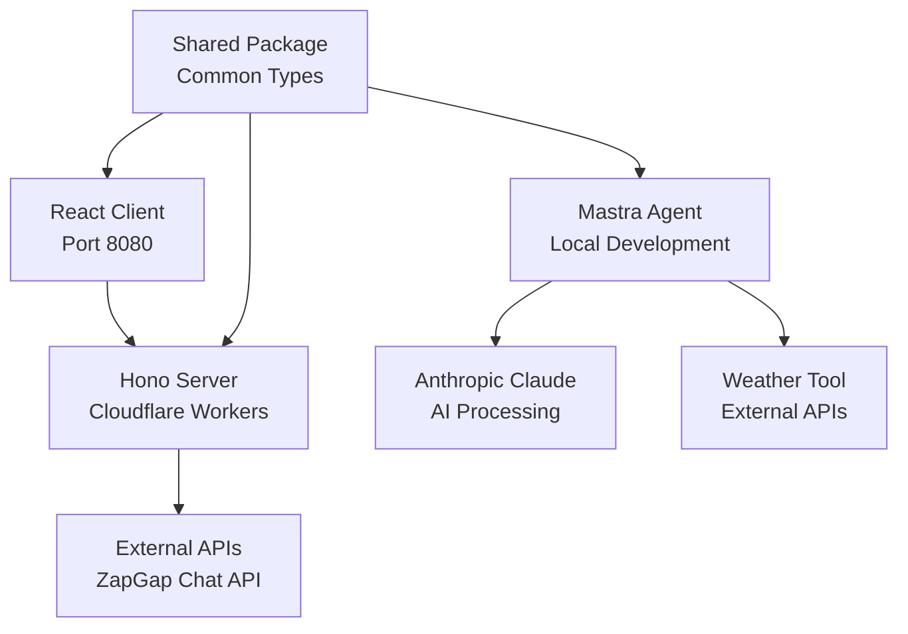

Here's a comprehensive **project summary** for **ZapGap**, an AI-powered infrastructure automation platform built with a modern monorepo architecture.

---

# 🧠 ZapGap – AI Infrastructure Automation Platform

## 🎯 Goal

**ZapGap** is an AI-powered infrastructure automation platform that provides conversational interfaces for cloud operations, incident remediation, and infrastructure management. The system uses AI agents to bridge the gap between human operators and complex cloud infrastructure.

---

## 📦 Current Tech Stack

| Layer           | Technology                                                       | Purpose                                    |
| --------------- | ---------------------------------------------------------------- | ------------------------------------------ |
| **Frontend**    | [React](https://react.dev) + [Vite](https://vitejs.dev)        | Modern web application with hot reloading |
| **UI Library**  | [ShadCN/UI](https://ui.shadcn.com) + [TailwindCSS](https://tailwindcss.com) | Component library and styling |
| **Backend API** | [Hono](https://hono.dev) on Cloudflare Workers                  | Serverless API with edge deployment       |
| **AI Agents**   | [Mastra](https://mastra.ai) + Anthropic Claude                  | AI agent framework with LLM integration   |
| **Runtime**     | [Bun](https://bun.sh)                                           | Fast JavaScript runtime and package manager |
| **Deployment** | Cloudflare Workers + Wrangler                                   | Edge computing platform                    |
| **Monorepo**    | Bun Workspaces                                                   | Unified dependency management              |

---

## 🏗️ Architecture Overview

### 📁 Monorepo Structure

```
zapgap-app/
├── client/          # React frontend application
├── server/          # Hono API on Cloudflare Workers  
├── agent/           # Mastra AI agents and workflows
├── shared/          # Common types and utilities
├── docs/            # Project documentation
├── package.json     # Root workspace configuration
└── build.sh         # Build automation script
```

### 🔄 Component Interactions



---

## ⚙️ Current Implementation

### 🎨 Frontend (Client)

* **Framework**: React 18 with TypeScript
* **Build Tool**: Vite with SWC for fast compilation
* **UI Components**: ShadCN/UI component library
* **Styling**: TailwindCSS with custom animations
* **Routing**: React Router DOM for SPA navigation
* **State Management**: TanStack Query for server state
* **Key Features**:
  - Landing page with animated hero section
  - Interactive demo page with chat interface
  - Features showcase and use cases
  - Integration with external ZapGap Chat API

### 🚀 Backend (Server)

* **Framework**: Hono - lightweight web framework
* **Runtime**: Cloudflare Workers for edge deployment
* **Configuration**: Wrangler for deployment and development
* **Current State**: Basic "Hello Hono!" endpoint
* **Planned Features**:
  - Session management
  - Agent orchestration
  - API routing and middleware

### 🤖 AI Agents (Agent)

* **Framework**: Mastra AI platform
* **LLM Provider**: Anthropic Claude 3.5 Sonnet
* **Storage**: LibSQL for agent memory and telemetry
* **Current Implementation**:
  - Weather agent with tool integration
  - Weather workflow for multi-step operations
  - Memory persistence for conversation context
* **Tools**: Weather API integration as example
* **Workflows**: Weather-based activity planning

### 📦 Shared Package

* **Purpose**: Common utilities and type definitions
* **Build**: TypeScript compilation to dist/
* **Current State**: Minimal implementation
* **Usage**: Imported by all other packages

---

## 🔄 Data Flow Patterns

### 1. Frontend to External API
```
User Input → React Component → Fetch API → ZapGap Chat API → AI Response
```

### 2. Agent Processing (Local Development)
```
User Query → Mastra Agent → Claude LLM → Tool Execution → Response
```

### 3. Monorepo Dependencies
```
Root Package → Shared Build → Client/Server/Agent Import
```

---

## 🛠️ Development Workflow

### Build Process
1. **Shared Package**: TypeScript compilation (`tsc`)
2. **Client**: Vite build with React and TailwindCSS
3. **Server**: Wrangler deployment to Cloudflare Workers
4. **Agent**: Mastra build and development server

### Development Commands
```bash
# Start all services concurrently
bun run dev

# Individual service development
bun run dev:client    # React dev server (port 8080)
bun run dev:server    # Wrangler dev server
bun run dev:agent     # Mastra development
bun run dev:shared    # TypeScript watch mode
```

### Deployment
- **Client**: Static build via Vite
- **Server**: Cloudflare Workers via Wrangler
- **Agent**: Mastra deployment (development/production)

---

## 🔧 Configuration & Setup

### Package Management
- **Runtime**: Bun for fast package installation and execution
- **Workspaces**: Unified dependency management across packages
- **TypeScript**: Shared configuration with package-specific overrides

### Development Environment
- **Node Version**: >=20.9.0 (for agent package)
- **Package Manager**: Bun (specified in package.json)
- **Build Tools**: Native TypeScript compilation and Vite

### External Integrations
- **ZapGap Chat API**: `https://zapgap-api.deno.dev/chat`
- **Weather API**: Open-Meteo for agent demonstrations
- **Anthropic API**: Claude LLM integration via Mastra

---

## 🚀 Current Capabilities

### Implemented Features
1. **Interactive Web Interface**: Modern React application with animations
2. **AI Chat Demo**: Integration with external ZapGap Chat API
3. **Agent Framework**: Mastra-based AI agents with tool integration
4. **Monorepo Architecture**: Unified development and build process
5. **Edge Deployment**: Cloudflare Workers for serverless API

### Demo Functionality
- **Chat Interface**: Real-time conversation with AI assistant
- **Session Management**: Unique session IDs for conversation context
- **Error Handling**: Graceful degradation for API failures
- **Responsive Design**: Mobile-friendly interface

---

## 🎯 Next Steps

### Immediate Priorities
1. **Server Implementation**: Expand Hono API beyond basic endpoint
2. **Agent Integration**: Connect Mastra agents to server API
3. **Session Management**: Implement proper session handling
4. **Database Integration**: Add persistent storage for sessions

### Future Enhancements
1. **Authentication**: User management and access control
2. **Multi-Agent Support**: Orchestration of multiple specialized agents
3. **Infrastructure Tools**: AWS, Azure, GCP integrations
4. **Monitoring**: Observability and logging infrastructure

---

## 🔍 Detailed Component Analysis

### Frontend Architecture Patterns

The client application follows modern React patterns:

<augment_code_snippet path="client/src/App.tsx" mode="EXCERPT">
````typescript
const App = () => (
  <QueryClientProvider client={queryClient}>
    <TooltipProvider>
      <Toaster />
      <Sonner />
      <BrowserRouter>
        <Routes>
          <Route path="/" element={<Index />} />
          <Route path="/features" element={<Features />} />
          <Route path="/demo" element={<Demo />} />
          <Route path="*" element={<NotFound />} />
        </Routes>
      </BrowserRouter>
    </TooltipProvider>
  </QueryClientProvider>
);
````
</augment_code_snippet>

**Key Patterns**:
- **Provider Pattern**: QueryClient and TooltipProvider for global state
- **Component Composition**: Modular UI components with ShadCN/UI
- **Route-based Code Splitting**: Separate pages for different functionality

### Backend API Structure

The server uses Hono's lightweight framework:

<augment_code_snippet path="server/src/index.ts" mode="EXCERPT">
````typescript
import { Hono } from 'hono'

const app = new Hono()

app.get('/', (c) => {
  return c.text('Hello Hono!')
})

export default app
````
</augment_code_snippet>

**Current State**: Minimal implementation with single endpoint
**Deployment**: Cloudflare Workers via Wrangler configuration

### AI Agent Implementation

The agent system uses Mastra's framework:

<augment_code_snippet path="agent/src/mastra/index.ts" mode="EXCERPT">
````typescript
export const mastra = new Mastra({
  workflows: { weatherWorkflow },
  agents: { weatherAgent },
  storage: new LibSQLStore({
    url: ":memory:",
  }),
  logger: new PinoLogger({
    name: 'Mastra',
    level: 'info',
  }),
});
````
</augment_code_snippet>

**Architecture Features**:
- **Modular Agents**: Separate agent definitions for different capabilities
- **Workflow System**: Multi-step operations with tool integration
- **Memory Persistence**: LibSQL storage for conversation context
- **Logging**: Structured logging with Pino

---

## 🌐 Integration Patterns

### External API Communication

The demo page integrates with external services:

<augment_code_snippet path="client/src/pages/Demo.tsx" mode="EXCERPT">
````typescript
const ZAPGAP_API = {
  endpoint: 'https://zapgap-api.deno.dev/chat',
};

const callZapGapAPI = async (userMessage: string): Promise<string> => {
  const url = new URL(ZAPGAP_API.endpoint);
  url.searchParams.set('chatId', sessionId);

  const response = await fetch(url.toString(), {
    method: 'POST',
    headers: { 'Content-Type': 'application/json' },
    body: JSON.stringify({ msg: userMessage }),
  });
  // ... error handling and response processing
};
````
</augment_code_snippet>

**Integration Patterns**:
- **Session-based Communication**: Unique session IDs for context
- **Error Handling**: Graceful degradation for API failures
- **Type Safety**: TypeScript interfaces for API contracts

### Tool Integration in Agents

<augment_code_snippet path="agent/src/mastra/tools/weather-tool.ts" mode="EXCERPT">
````typescript
export const weatherTool = createTool({
  id: 'get-weather',
  description: 'Get current weather for a location',
  inputSchema: z.object({
    location: z.string().describe('City name'),
  }),
  outputSchema: z.object({
    temperature: z.number(),
    feelsLike: z.number(),
    // ... other weather properties
  }),
  execute: async ({ context }) => {
    return await getWeather(context.location);
  },
});
````
</augment_code_snippet>

**Tool Architecture**:
- **Schema Validation**: Zod schemas for input/output validation
- **Async Execution**: Promise-based tool execution
- **External API Integration**: Weather API calls with error handling

---

## 📊 Performance & Scalability

### Build Optimization

The monorepo uses optimized build processes:

**Shared Package**: TypeScript compilation with watch mode for development
**Client**: Vite with SWC for fast React compilation and hot reloading
**Server**: Wrangler for edge deployment with automatic optimization
**Agent**: Mastra's built-in build system for AI workflows

### Development Performance

- **Concurrent Development**: All services run simultaneously with `bun run dev`
- **Hot Reloading**: Vite provides instant feedback for frontend changes
- **TypeScript Watch**: Shared package rebuilds automatically on changes
- **Edge Deployment**: Cloudflare Workers for low-latency API responses

---

This architecture provides a solid foundation for an AI-powered infrastructure automation platform, with clear separation of concerns and modern development practices.
