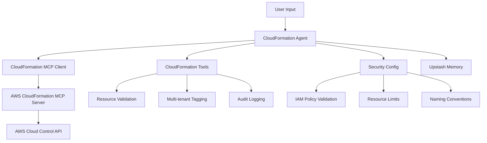

# 🏗️ CloudFormation Integration Guide

## Overview

The ZapGap CloudFormation integration provides comprehensive AWS infrastructure management capabilities through natural language interfaces. Built on top of the AWS CloudFormation MCP (Model Context Protocol) server, it enables users to create, manage, and monitor AWS resources using conversational AI.

## 🚀 Features

### Core Capabilities
- **Resource Management**: Create, read, update, delete, and list AWS resources
- **Schema Information**: Get CloudFormation resource schemas and property details
- **Template Generation**: Create CloudFormation templates from existing resources
- **Request Tracking**: Monitor the status of resource operations
- **Multi-tenant Support**: Automatic resource tagging and isolation
- **Security Controls**: IAM policy recommendations and validation

### Advanced Features
- **Workflow Automation**: Multi-step infrastructure deployments
- **Cost Management**: Resource tagging for billing and cost allocation
- **Audit Logging**: Comprehensive operation tracking
- **Error Recovery**: Rollback strategies and error handling
- **Environment Management**: Development, staging, and production isolation

## 🔧 Configuration

### Environment Variables

```bash
# AI Model Configuration
ANTHROPIC_API_KEY=your_anthropic_api_key

# AWS Configuration
AWS_ACCESS_KEY_ID=your_aws_access_key
AWS_SECRET_ACCESS_KEY=your_aws_secret_key
AWS_SESSION_TOKEN=your_aws_session_token  # Optional for temporary credentials
AWS_REGION=us-east-1
AWS_PROFILE=default

# CloudFormation MCP Server Configuration
CFN_MCP_SERVER_READONLY=false  # Set to true for read-only operations
CFN_MCP_SERVER_TIMEOUT=30000   # Timeout in milliseconds
CFN_MCP_SERVER_MAX_RETRIES=3   # Maximum retry attempts

# Multi-tenant Configuration
TENANT_ID=your_tenant_id
RESOURCE_TAG_PREFIX=zapgap
MAX_RESOURCES_PER_TENANT=100
ALLOWED_RESOURCE_TYPES=AWS::S3::Bucket,AWS::EC2::Instance  # Optional restriction

# Upstash Storage (for agent memory)
UPSTASH_REDIS_REST_URL=your_upstash_redis_url
UPSTASH_REDIS_REST_TOKEN=your_upstash_redis_token
UPSTASH_VECTOR_REST_URL=your_upstash_vector_url
UPSTASH_VECTOR_REST_TOKEN=your_upstash_vector_token
```

### IAM Permissions

The CloudFormation agent requires the following IAM permissions:

```json
{
  "Version": "2012-10-17",
  "Statement": [
    {
      "Effect": "Allow",
      "Action": [
        "cloudcontrol:ListResources",
        "cloudcontrol:GetResource",
        "cloudcontrol:CreateResource",
        "cloudcontrol:UpdateResource",
        "cloudcontrol:DeleteResource",
        "cloudformation:CreateGeneratedTemplate",
        "cloudformation:DescribeGeneratedTemplate",
        "cloudformation:GetGeneratedTemplate"
      ],
      "Resource": "*",
      "Condition": {
        "StringEquals": {
          "aws:RequestedRegion": "us-east-1"
        }
      }
    },
    {
      "Effect": "Allow",
      "Action": [
        "tag:GetResources",
        "tag:TagResources",
        "tag:UntagResources"
      ],
      "Resource": "*"
    }
  ]
}
```

## 📖 Usage Examples

### Basic Resource Operations

#### Create an S3 Bucket
```
User: "Create an S3 bucket for storing application logs"

Agent: I'll create an S3 bucket for log storage with appropriate security settings.

[Creates bucket with automatic tagging for tenant isolation]
```

#### List EC2 Instances
```
User: "Show me all EC2 instances in us-west-2"

Agent: I'll list all EC2 instances in the us-west-2 region for your tenant.

[Returns filtered list of instances with current status]
```

#### Get Resource Details
```
User: "Get details for the S3 bucket named 'my-app-logs'"

Agent: I'll retrieve the configuration details for your S3 bucket.

[Returns bucket properties, permissions, and settings]
```

### Advanced Operations

#### Infrastructure Deployment
```
User: "Deploy a web application infrastructure with load balancer, auto scaling, and RDS database"

Agent: I'll create a comprehensive web application infrastructure. Let me break this down into components:

1. VPC and networking components
2. Application Load Balancer
3. Auto Scaling Group with EC2 instances
4. RDS database instance
5. Security groups and IAM roles

[Executes multi-step deployment workflow]
```

#### Template Generation
```
User: "Generate a CloudFormation template for all my S3 buckets"

Agent: I'll create a CloudFormation template that includes all your S3 buckets for infrastructure as code management.

[Generates YAML/JSON template with all bucket configurations]
```

### Security and Compliance

#### Resource Validation
```
User: "Create an EC2 instance with public access"

Agent: I notice you're requesting public access for an EC2 instance. For security best practices, I recommend:

1. Using a bastion host or VPN for access
2. Implementing security groups with minimal required ports
3. Enabling CloudTrail logging

Would you like me to proceed with a more secure configuration?
```

## 🏗️ Architecture

### Component Overview



### Multi-tenant Architecture

- **Resource Isolation**: Automatic tagging ensures resources are isolated by tenant
- **Cost Allocation**: Tags enable accurate billing and cost tracking
- **Security Boundaries**: IAM policies restrict access to tenant-specific resources
- **Audit Trail**: All operations are logged with tenant context

## 🔒 Security Best Practices

### Resource Tagging
All resources are automatically tagged with:
- `zapgap:tenant`: Tenant identifier
- `zapgap:environment`: Environment (dev/staging/prod)
- `zapgap:created-by`: Creator identification
- `zapgap:created-at`: Creation timestamp
- `zapgap:cost-center`: Cost allocation

### Access Controls
- Tenant-scoped resource access
- Environment-specific restrictions
- Operation-level permissions
- Audit logging for compliance

### Data Protection
- Encryption at rest and in transit
- Secure credential management
- Network security best practices
- Regular security assessments

## 🚨 Troubleshooting

### Common Issues

#### MCP Server Connection Failed
```bash
# Check if uvx is installed
uvx --version

# Verify AWS credentials
aws sts get-caller-identity

# Check environment variables
echo $AWS_PROFILE
echo $AWS_REGION
```

#### Permission Denied Errors
- Verify IAM permissions match required policy
- Check AWS credential configuration
- Ensure region is correctly set
- Validate resource-level permissions

#### Resource Creation Failures
- Check AWS service limits
- Verify resource naming conventions
- Validate required properties
- Review dependency requirements

### Debug Mode

Enable debug logging by setting:
```bash
export DEBUG=true
export LOG_LEVEL=debug
```

## 📊 Monitoring and Observability

### Metrics
- Resource creation/modification rates
- Error rates by operation type
- Cost allocation by tenant
- Performance metrics

### Logging
- Structured JSON logging
- Operation audit trails
- Error tracking and alerting
- Performance monitoring

### Alerting
- Failed operations
- Cost threshold breaches
- Security policy violations
- Resource limit approaches

## 🔄 Workflow Integration

The CloudFormation integration supports complex workflows for:
- Multi-environment deployments
- Blue-green deployments
- Disaster recovery setup
- Cost optimization
- Security compliance

## 📚 API Reference

### Available Tools
- `cfn-create-resource`: Create AWS resources
- `cfn-get-resource`: Retrieve resource details
- `cfn-update-resource`: Update existing resources
- `cfn-delete-resource`: Delete resources (with confirmation)
- `cfn-list-resources`: List resources by type
- `cfn-get-resource-schema`: Get CloudFormation schemas
- `cfn-get-request-status`: Check operation status
- `cfn-create-template`: Generate CloudFormation templates

### Workflow Steps
- `analyze-requirements`: Infrastructure planning
- `validate-resources`: Configuration validation
- `deploy-resources`: Resource deployment

For detailed API documentation, see the tool implementations in `agent/src/mastra/tools/cfn-tools.ts`.

## 🎯 Best Practices

### Development Workflow
1. **Start Small**: Begin with simple resources like S3 buckets
2. **Test First**: Always test in development environment
3. **Use Templates**: Generate templates for repeatable deployments
4. **Monitor Costs**: Track resource costs with proper tagging
5. **Security Review**: Validate security configurations before production

### Production Deployment
1. **Staged Rollouts**: Deploy to staging before production
2. **Backup Strategy**: Ensure data backup before modifications
3. **Rollback Plan**: Have rollback procedures ready
4. **Monitoring**: Set up alerts for critical resources
5. **Documentation**: Document all infrastructure changes

### Cost Optimization
1. **Right-sizing**: Choose appropriate instance types
2. **Scheduling**: Use scheduling for non-production resources
3. **Reserved Instances**: Consider reserved instances for predictable workloads
4. **Storage Classes**: Use appropriate S3 storage classes
5. **Regular Reviews**: Conduct monthly cost reviews

## 🔗 Integration with ZapGap

The CloudFormation integration seamlessly integrates with the ZapGap ecosystem:

- **Ephemeral Pods**: Each agent pod has isolated AWS credentials
- **Session Management**: Infrastructure operations are tracked per session
- **Multi-tenancy**: Automatic tenant isolation and resource tagging
- **Audit Logging**: All operations are logged for compliance
- **Cost Tracking**: Resource costs are allocated to appropriate tenants

## 🚀 Getting Started

1. **Setup Environment**: Configure AWS credentials and environment variables
2. **Start Agent**: Run `bun run dev` in the agent directory
3. **Test Connection**: Verify MCP server connectivity
4. **Create First Resource**: Start with a simple S3 bucket
5. **Explore Features**: Try listing, updating, and deleting resources
6. **Advanced Usage**: Experiment with workflows and template generation

## 📞 Support

For issues and questions:
- Check the troubleshooting section above
- Review the CloudFormation MCP server documentation
- Consult AWS CloudFormation documentation
- Open an issue in the ZapGap repository
