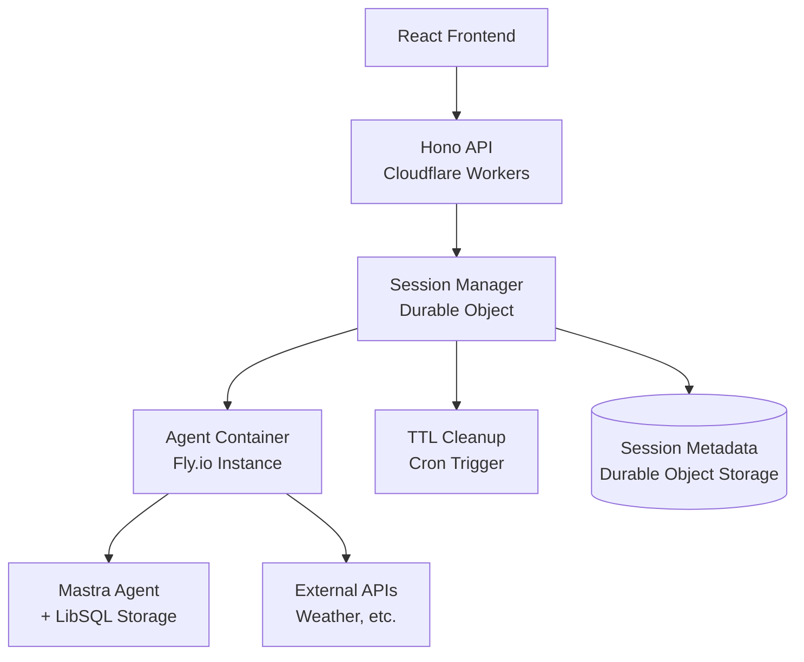

# 🚀 Ephemeral AI Agent Pods Implementation Plan

## 🏗️ Architecture Overview

### Hybrid Cloudflare + Container Strategy

We'll implement a two-layer architecture that leverages the strengths of both serverless and containerized environments:



### Key Components

1. **Session Management Layer** (Cloudflare)
   - Hono API endpoints for session CRUD operations
   - Durable Objects for session state and coordination
   - Automatic cleanup via Cron Triggers

2. **Agent Execution Layer** (Containers)
   - Fly.io containers running Mastra agents
   - HTTP server for communication with session manager
   - Isolated storage and memory per container

3. **Communication Bridge**
   - REST API between Durable Objects and containers
   - Session routing and request proxying
   - Health monitoring and error handling

---

## 📋 Implementation Phases

### Phase 1: Core Infrastructure (Week 1-2)

#### 1.1 Extend Hono API with Session Management

```typescript
// server/src/routes/sessions.ts
import { Hono } from 'hono'
import { SessionManager } from '../services/SessionManager'

const sessions = new Hono()

// Create new agent session
sessions.post('/sessions', async (c) => {
  const sessionManager = new SessionManager(c.env)
  const session = await sessionManager.createSession()
  
  return c.json({
    sessionId: session.id,
    status: 'creating',
    endpoint: session.endpoint
  })
})

// Send message to agent session
sessions.post('/sessions/:sessionId/messages', async (c) => {
  const { sessionId } = c.req.param()
  const { message } = await c.req.json()
  
  const sessionManager = new SessionManager(c.env)
  const response = await sessionManager.sendMessage(sessionId, message)
  
  return c.json(response)
})

// Terminate agent session
sessions.delete('/sessions/:sessionId', async (c) => {
  const { sessionId } = c.req.param()
  const sessionManager = new SessionManager(c.env)
  
  await sessionManager.terminateSession(sessionId)
  return c.json({ status: 'terminated' })
})

export { sessions }
```

#### 1.2 Create Durable Object for Session Management

```typescript
// server/src/durable-objects/AgentSession.ts
export class AgentSession {
  private state: DurableObjectState
  private env: Env
  private sessionData: SessionData
  private lastActivity: number

  constructor(state: DurableObjectState, env: Env) {
    this.state = state
    this.env = env
    this.lastActivity = Date.now()
  }

  async fetch(request: Request): Promise<Response> {
    const url = new URL(request.url)
    const path = url.pathname

    switch (path) {
      case '/create':
        return this.createAgentContainer()
      case '/message':
        return this.forwardMessage(request)
      case '/terminate':
        return this.terminateSession()
      case '/health':
        return this.healthCheck()
      default:
        return new Response('Not found', { status: 404 })
    }
  }

  private async createAgentContainer(): Promise<Response> {
    // Spawn container on Fly.io
    const containerInfo = await this.spawnContainer()
    
    this.sessionData = {
      id: this.generateSessionId(),
      containerEndpoint: containerInfo.endpoint,
      createdAt: Date.now(),
      status: 'active'
    }
    
    await this.state.storage.put('session', this.sessionData)
    
    return new Response(JSON.stringify(this.sessionData))
  }

  private async spawnContainer(): Promise<ContainerInfo> {
    // Use Fly.io API to create container instance
    const response = await fetch('https://api.machines.dev/v1/apps/zapgap-agents/machines', {
      method: 'POST',
      headers: {
        'Authorization': `Bearer ${this.env.FLY_API_TOKEN}`,
        'Content-Type': 'application/json'
      },
      body: JSON.stringify({
        config: {
          image: 'zapgap/agent:latest',
          env: {
            SESSION_ID: this.generateSessionId(),
            ANTHROPIC_API_KEY: this.env.ANTHROPIC_API_KEY
          },
          services: [{
            ports: [{ port: 8080, handlers: ['http'] }],
            protocol: 'tcp',
            internal_port: 8080
          }]
        }
      })
    })

    const machine = await response.json()
    return {
      id: machine.id,
      endpoint: `https://${machine.id}.zapgap-agents.internal:8080`
    }
  }

  private async forwardMessage(request: Request): Promise<Response> {
    this.lastActivity = Date.now()
    
    const sessionData = await this.state.storage.get('session')
    if (!sessionData) {
      return new Response('Session not found', { status: 404 })
    }

    // Forward request to container
    const response = await fetch(`${sessionData.containerEndpoint}/chat`, {
      method: 'POST',
      headers: { 'Content-Type': 'application/json' },
      body: await request.text()
    })

    return response
  }

  private async terminateSession(): Promise<Response> {
    const sessionData = await this.state.storage.get('session')
    if (sessionData) {
      // Terminate container on Fly.io
      await this.destroyContainer(sessionData.containerId)
      await this.state.storage.delete('session')
    }
    
    return new Response(JSON.stringify({ status: 'terminated' }))
  }

  // Auto-cleanup for TTL
  async alarm(): Promise<void> {
    const TTL = 30 * 60 * 1000 // 30 minutes
    if (Date.now() - this.lastActivity > TTL) {
      await this.terminateSession()
    } else {
      // Reset alarm for next check
      await this.state.storage.setAlarm(Date.now() + TTL)
    }
  }
}
```

#### 1.3 Container Image for Mastra Agent

```dockerfile
# agent/Dockerfile
FROM node:20-alpine

WORKDIR /app

# Copy package files
COPY package.json bun.lock ./
COPY src/ ./src/

# Install dependencies
RUN npm install -g bun
RUN bun install

# Build the agent
RUN bun run build

# Expose port
EXPOSE 8080

# Start the agent HTTP server
CMD ["bun", "run", "start:server"]
```

```typescript
// agent/src/server.ts
import { Hono } from 'hono'
import { mastra } from './mastra'

const app = new Hono()

app.post('/chat', async (c) => {
  const { message } = await c.req.json()
  const sessionId = c.env.SESSION_ID
  
  try {
    // Use Mastra agent to process message
    const response = await mastra.agents.weatherAgent.chat([{
      role: 'user',
      content: message
    }])
    
    return c.json({
      response: response.content,
      sessionId
    })
  } catch (error) {
    return c.json({ error: error.message }, 500)
  }
})

app.get('/health', (c) => {
  return c.json({ status: 'healthy', sessionId: c.env.SESSION_ID })
})

export default {
  port: 8080,
  fetch: app.fetch
}
```

---

## 🔧 Configuration Updates

### Update Wrangler Configuration

```jsonc
// server/wrangler.jsonc
{
  "$schema": "node_modules/wrangler/config-schema.json",
  "name": "zapgap-server",
  "main": "src/index.ts",
  "compatibility_date": "2025-01-15",
  "durable_objects": {
    "bindings": [
      {
        "name": "AGENT_SESSION",
        "class_name": "AgentSession",
        "script_name": "zapgap-server"
      }
    ]
  },
  "vars": {
    "FLY_API_TOKEN": "your-fly-api-token",
    "ANTHROPIC_API_KEY": "your-anthropic-key"
  },
  "triggers": {
    "crons": ["*/5 * * * *"]  // Cleanup every 5 minutes
  }
}
```

### Update Package Dependencies

```json
// server/package.json additions
{
  "dependencies": {
    "hono": "^4.7.11",
    "@cloudflare/workers-types": "^4.20241218.0"
  }
}
```

---

## 📊 Session Lifecycle Management

### Session States

1. **Creating**: Container is being spawned
2. **Active**: Container is running and ready
3. **Idle**: No recent activity (approaching TTL)
4. **Terminating**: Container is being destroyed
5. **Terminated**: Session ended

### TTL and Cleanup Strategy

- **Inactivity TTL**: 30 minutes of no messages
- **Maximum TTL**: 2 hours regardless of activity
- **Cleanup Frequency**: Every 5 minutes via Cron Trigger
- **Graceful Shutdown**: 30-second warning before termination

---

## 🚀 Deployment Strategy

### Phase 1 Deployment

1. **Deploy Updated Server**: Cloudflare Workers with Durable Objects
2. **Build Agent Container**: Create and push to container registry
3. **Setup Fly.io App**: Configure auto-scaling and networking
4. **Test Session Creation**: Verify end-to-end functionality
5. **Monitor Resource Usage**: Track costs and performance

### Integration with Frontend

```typescript
// client/src/services/SessionService.ts
export class SessionService {
  private baseUrl = '/api'
  
  async createSession(): Promise<Session> {
    const response = await fetch(`${this.baseUrl}/sessions`, {
      method: 'POST',
      headers: { 'Content-Type': 'application/json' }
    })
    return response.json()
  }
  
  async sendMessage(sessionId: string, message: string): Promise<AgentResponse> {
    const response = await fetch(`${this.baseUrl}/sessions/${sessionId}/messages`, {
      method: 'POST',
      headers: { 'Content-Type': 'application/json' },
      body: JSON.stringify({ message })
    })
    return response.json()
  }
  
  async terminateSession(sessionId: string): Promise<void> {
    await fetch(`${this.baseUrl}/sessions/${sessionId}`, {
      method: 'DELETE'
    })
  }
}
```

---

## 🔒 Security & Isolation

### Container Security

```typescript
// agent/src/security/isolation.ts
export class SessionIsolation {
  private sessionId: string
  private storage: Map<string, any>

  constructor(sessionId: string) {
    this.sessionId = sessionId
    this.storage = new Map()
  }

  // Isolated storage per session
  async getSessionData(key: string): Promise<any> {
    return this.storage.get(`${this.sessionId}:${key}`)
  }

  async setSessionData(key: string, value: any): Promise<void> {
    this.storage.set(`${this.sessionId}:${key}`, value)
  }

  // Prevent cross-session data access
  validateSessionAccess(requestSessionId: string): boolean {
    return requestSessionId === this.sessionId
  }
}
```

### Network Isolation

- **Container Networking**: Each container gets isolated network namespace
- **API Authentication**: Session tokens for container communication
- **Resource Limits**: CPU/memory limits per container
- **Data Encryption**: TLS for all inter-service communication

---

## 📈 Monitoring & Observability

### Health Monitoring

```typescript
// server/src/monitoring/HealthMonitor.ts
export class HealthMonitor {
  async checkSessionHealth(sessionId: string): Promise<HealthStatus> {
    const session = await this.getSession(sessionId)

    try {
      const response = await fetch(`${session.containerEndpoint}/health`, {
        timeout: 5000
      })

      return {
        status: response.ok ? 'healthy' : 'unhealthy',
        lastCheck: Date.now(),
        responseTime: response.headers.get('x-response-time')
      }
    } catch (error) {
      return {
        status: 'unhealthy',
        error: error.message,
        lastCheck: Date.now()
      }
    }
  }

  async getSessionMetrics(sessionId: string): Promise<SessionMetrics> {
    return {
      messagesProcessed: await this.getMessageCount(sessionId),
      averageResponseTime: await this.getAverageResponseTime(sessionId),
      memoryUsage: await this.getMemoryUsage(sessionId),
      uptime: await this.getUptime(sessionId)
    }
  }
}
```

### Logging Strategy

```typescript
// shared/src/logging/Logger.ts
export class SessionLogger {
  constructor(private sessionId: string) {}

  info(message: string, metadata?: any): void {
    console.log(JSON.stringify({
      level: 'info',
      sessionId: this.sessionId,
      message,
      metadata,
      timestamp: new Date().toISOString()
    }))
  }

  error(message: string, error?: Error): void {
    console.error(JSON.stringify({
      level: 'error',
      sessionId: this.sessionId,
      message,
      error: error?.stack,
      timestamp: new Date().toISOString()
    }))
  }
}
```

---

## 🎯 Performance Optimization

### Container Warm-up Strategy

```typescript
// server/src/optimization/WarmupManager.ts
export class WarmupManager {
  private warmContainers: Map<string, ContainerInfo> = new Map()

  async maintainWarmPool(size: number = 3): Promise<void> {
    const currentWarm = this.warmContainers.size

    if (currentWarm < size) {
      const needed = size - currentWarm
      for (let i = 0; i < needed; i++) {
        await this.createWarmContainer()
      }
    }
  }

  async getWarmContainer(): Promise<ContainerInfo | null> {
    const containers = Array.from(this.warmContainers.values())
    if (containers.length > 0) {
      const container = containers[0]
      this.warmContainers.delete(container.id)
      return container
    }
    return null
  }

  private async createWarmContainer(): Promise<void> {
    const container = await this.spawnContainer()
    this.warmContainers.set(container.id, container)

    // Remove from warm pool after 10 minutes
    setTimeout(() => {
      this.warmContainers.delete(container.id)
      this.destroyContainer(container.id)
    }, 10 * 60 * 1000)
  }
}
```

### Resource Management

```typescript
// server/src/resources/ResourceManager.ts
export class ResourceManager {
  private readonly MAX_CONCURRENT_SESSIONS = 100
  private readonly MAX_MEMORY_PER_SESSION = '512MB'
  private readonly MAX_CPU_PER_SESSION = '0.5'

  async checkResourceAvailability(): Promise<boolean> {
    const activeSessions = await this.getActiveSessionCount()
    return activeSessions < this.MAX_CONCURRENT_SESSIONS
  }

  getContainerConfig(): ContainerConfig {
    return {
      resources: {
        memory: this.MAX_MEMORY_PER_SESSION,
        cpu: this.MAX_CPU_PER_SESSION
      },
      restart: 'never',
      autoDestroy: true
    }
  }
}
```

---

## 🧪 Testing Strategy

### Integration Tests

```typescript
// tests/integration/session-lifecycle.test.ts
describe('Session Lifecycle', () => {
  test('should create and terminate session', async () => {
    // Create session
    const session = await sessionService.createSession()
    expect(session.sessionId).toBeDefined()
    expect(session.status).toBe('creating')

    // Wait for container to be ready
    await waitForSessionReady(session.sessionId)

    // Send message
    const response = await sessionService.sendMessage(
      session.sessionId,
      'What is the weather in London?'
    )
    expect(response.response).toContain('weather')

    // Terminate session
    await sessionService.terminateSession(session.sessionId)

    // Verify cleanup
    const healthCheck = await checkSessionHealth(session.sessionId)
    expect(healthCheck.status).toBe('terminated')
  })

  test('should handle TTL cleanup', async () => {
    const session = await sessionService.createSession()

    // Simulate inactivity
    await sleep(31 * 60 * 1000) // 31 minutes

    // Session should be auto-terminated
    const healthCheck = await checkSessionHealth(session.sessionId)
    expect(healthCheck.status).toBe('terminated')
  })
})
```

### Load Testing

```typescript
// tests/load/concurrent-sessions.test.ts
describe('Concurrent Sessions Load Test', () => {
  test('should handle 50 concurrent sessions', async () => {
    const sessions = []

    // Create 50 sessions concurrently
    for (let i = 0; i < 50; i++) {
      sessions.push(sessionService.createSession())
    }

    const createdSessions = await Promise.all(sessions)
    expect(createdSessions).toHaveLength(50)

    // Send messages to all sessions
    const messages = createdSessions.map(session =>
      sessionService.sendMessage(session.sessionId, 'Hello')
    )

    const responses = await Promise.all(messages)
    expect(responses).toHaveLength(50)
    responses.forEach(response => {
      expect(response.response).toBeDefined()
    })

    // Cleanup
    await Promise.all(createdSessions.map(session =>
      sessionService.terminateSession(session.sessionId)
    ))
  })
})
```

---

## 🚀 Migration Plan

### Phase 1: Infrastructure Setup (Week 1)
- [ ] Deploy Durable Objects infrastructure
- [ ] Create container image and registry
- [ ] Setup Fly.io application
- [ ] Implement basic session CRUD operations

### Phase 2: Agent Integration (Week 2)
- [ ] Adapt Mastra agents for container environment
- [ ] Implement HTTP server for agent communication
- [ ] Add session isolation and storage
- [ ] Test agent functionality in containers

### Phase 3: Production Features (Week 3)
- [ ] Implement TTL and cleanup mechanisms
- [ ] Add monitoring and health checks
- [ ] Create resource management and limits
- [ ] Performance testing and optimization

### Phase 4: Frontend Integration (Week 4)
- [ ] Update demo page to use session API
- [ ] Add session management UI components
- [ ] Implement error handling and fallbacks
- [ ] User acceptance testing

### Phase 5: Production Deployment (Week 5)
- [ ] Deploy to production environment
- [ ] Monitor performance and costs
- [ ] Gradual traffic migration
- [ ] Documentation and training

---

This implementation provides true isolation, auto-scaling, and efficient resource management while maintaining compatibility with the existing ZapGap architecture.
