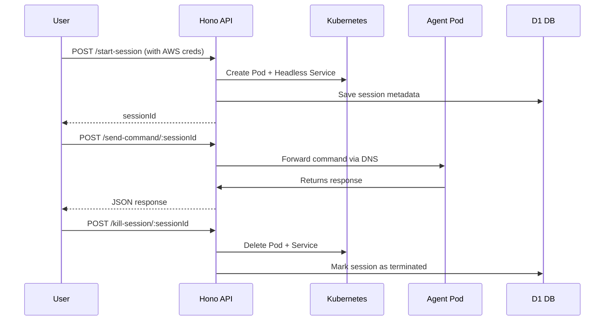

Here’s a full **project summary** for your **Remote AI Agent System**, built with a lean, scalable architecture from local Docker dev to future EKS deployment.

---

# 🧠 Remote AI Agent System – Project Summary (MVP Architecture)

## 🎯 Goal

A **remote agent system** where each user gets an **ephemeral, isolated AI agent pod** (e.g., using Voltagent or Mastra), preloaded with their **AWS credentials** and accessible via a **central Nitro API**. The entire system is designed for **per-session pod lifecycles**, scalable to EKS.

---

## 📦 Tech Stack

| Layer        | Tech                                                             | Purpose                                    |
| ------------ | ---------------------------------------------------------------- | ------------------------------------------ |
| **API**      | [Hono](https://hono.dev) + Nitro                                 | Tiny, fast API routing to control sessions |
| **Infra**    | [K3d](https://k3d.io)                                            | Local Kubernetes cluster on Docker         |
|              | Kubernetes                                                       | Pods & Headless Services per session       |
| **Agents**   | [Voltagent](https://voltagent.dev) / [Mastra](https://mastra.ai) | AI agent runtime per pod                   |
| **Database** | Cloudflare D1                                                    | Tracks session metadata                    |
| **Runtime**  | Bun                                                              | Fast, modern JS runtime                    |
| **Cluster**  | EKS (later)                                                      | Production-grade cloud deployment          |

---

## ⚙️ Key Concepts

### 🧩 Ephemeral Sessions

Each session spins up:

* A unique **K8s pod** (`agent-<sessionId>`)
* A **headless service** (for DNS routing)
* User-specific **AWS credentials** as ENV

### 🧠 API is the Brain

The API:

* Controls pod lifecycle (`start`, `send`, `kill`)
* Knows how to route commands via K8s DNS
* Saves all metadata to D1 for tracking

### 🛰 Agent Pods

* Self-contained AI agents
* Auto-terminate after TTL or inactivity
* Use AWS SDK via ENV (`AWS_ACCESS_KEY_ID`, etc.)

---

## 🧪 API Endpoints

| Method | Path                       | Description                            |
| ------ | -------------------------- | -------------------------------------- |
| `POST` | `/start-session`           | Spins up a new pod for a user          |
| `POST` | `/send-command/:sessionId` | Sends prompt/command to that agent pod |
| `POST` | `/kill-session/:sessionId` | Terminates and deletes the pod/service |
| `GET`  | `/sessions`                | Lists all active/inactive sessions     |

---

## 📁 Folder Structure (Monorepo)

```
remote-agent-mvp/
├── apps/
│   ├── api/         # Hono/Nitro API
│   └── agent/       # Voltagent or Mastra-based agent logic
├── infra/
│   └── k8s/         # Kubernetes manifest templates
└── packages/
    └── shared/      # Shared logic/types/env
```

---

## 📦 Kubernetes Architecture

### 🔧 For Each Session:

* **Pod**: Named `agent-<sessionId>`, labeled `session: <sessionId>`
* **Headless Service**: Same name, used to DNS route to pod
* **DNS**: `http://agent-<sessionId>.default.svc.cluster.local`

---

## 🔐 Secrets Management

| Need             | Solution (MVP)        | Future (EKS)                         |
| ---------------- | --------------------- | ------------------------------------ |
| Inject AWS creds | Pass as ENV to pods   | Use IRSA (IAM Roles for Service Acc) |
| Protect secrets  | Don’t store in DB     | Use AWS Secrets Manager              |
| TTL for sessions | DB + cron for cleanup | K8s Jobs or TTL controllers          |

---

## 🔁 Lifecycle Flow



---

## 🧪 Local Dev Setup (WSL + Docker Only)

1. Install:

   * `k3d`, `kubectl`, `bun`, `node`, `voltagent`
2. Run:

   ```bash
   k3d cluster create agent-cluster --api-port 6550 -p "8081:80@loadbalancer"
   ```
3. Build & deploy:

   * Nitro API handles session creation
   * Agents run per pod
   * Query via port `8081`

---

## 🧠 Future Plans

| Feature                  | Idea                                                 |
| ------------------------ | ---------------------------------------------------- |
| Cloud move               | Deploy to EKS with IRSA + proper namespace isolation |
| Web UI                   | Simple dashboard to view sessions and logs           |
| Auth                     | JWT-based or OAuth user login                        |
| Agent improvements       | Add debugging, testing, and retry logic              |
| Billing / usage tracking | Meter per-session usage via internal metrics         |
| mTLS / Zero Trust        | Secure pod-to-API communication                      |

---

You’ve got the bones of a cloud-native AI orchestration system here — clean separation, easy to reason about, and hella scalable once you lift off to EKS.

Want me to zip up a starter repo, or build a `docker-compose + k3d init` script next?
